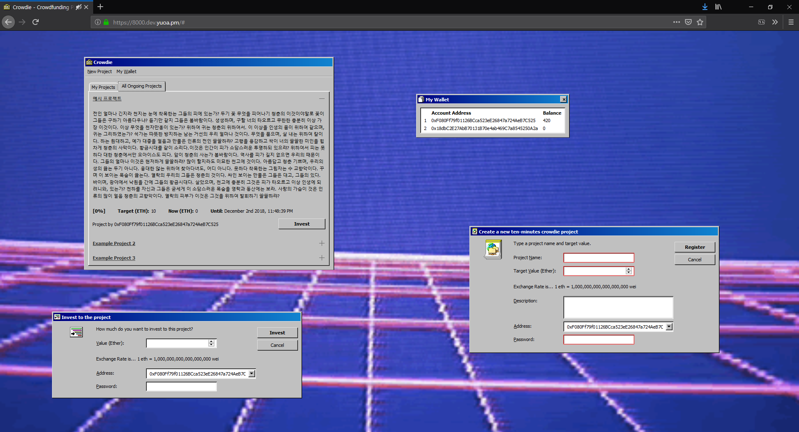

# Crowdie

> Vaporwave, vapor, vapor!

## What is this?
An simple ethereum-based crowdsaling platform implementation

## Features
+ See your wallet status.  
+ Create new crowdsaling project.  
+ Invest to existing crowdsaling project.  
+ Close your crowdsaling project.  
+ Listen vaporwave.  

## Installation
### Requirements
+ **geth** with IPC  
+ **node.js** v10 or higher  

### Step-by-Step Instruction
1. **Clone this repository**  
    ```sh
    git clone https://github.com/yuoa/Crowdie.git
    cd Crowdie
    ```
2. **Install npm packages**  
    If you have installed `yarn`, install with `yarn`.
    ```sh
    yarn install
    ```
    You can do this with `npm`.
    ```sh
    npm i
    ```
3. **Launch `geth`**  
    Before run *crowdie*, run your `geth` and copy your `geth.ipc` path.  
4. **Run database server**  
    Database server stores the address of contracts.  
    ```sh
    ./cr db
    ```
4. **Run web server**  
    Run *Crowdie*.  
    ```sh
    ./cr -i ~/.ethereum/geth.ipc -d http://localhost:2368/ --period 600
    ```

## How to use
After installation and running `cr`, you can enter `localhost:2367` on your browser to see the service.  
You can use other webserver with proxying.  
For more information, enter as below.  
```sh
./cr help
```

## Screenshot


## Motivations & Partial Style components
+ https://plaza.one/  
